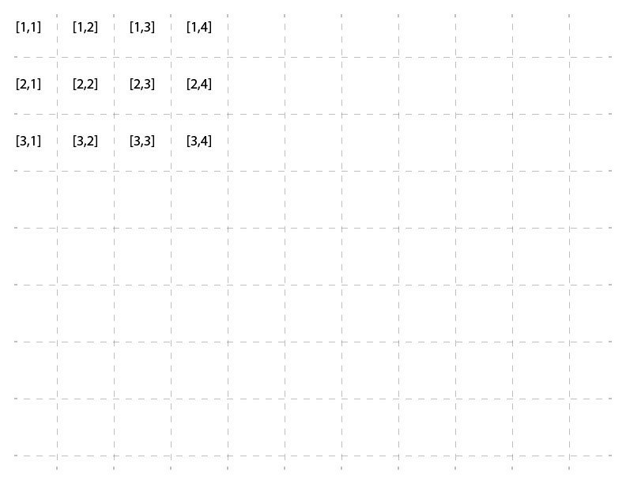
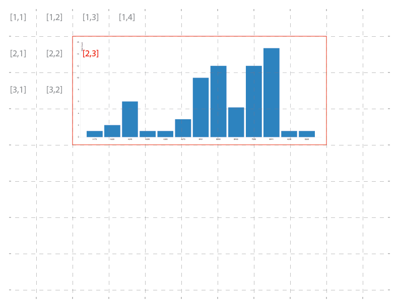
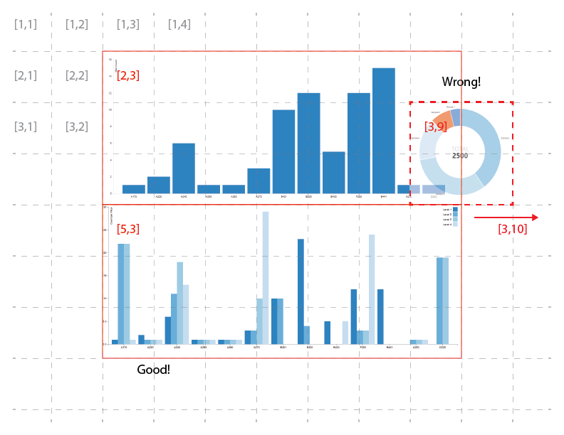

# Address

Mandrill now supports dynamic layout creation, thanks to a piece of Java Script library called Gridster. What Gridster is doing for us, is that it divides the whole page into a grid of cells. Each cell is <b>100px x 100px</b>. Starting in the top/left corner of the screen, each chart, image, legend added to the report and visualized in the window, now has an address. Rows and columns are numbered sequentially so top/left is [1,1]. Kind of like this: 

Something to keep in mind when specifying the address for a chart. It's address is relative to charts top/left corner. So for example telling a chart to be slotted at [2,3] would result in something like this: 

Each chart occupies a certain number of cells based on its width and height. For example, chart in the picture above is 7 cells wide and 3 cells tall. That means that its size was something between 601-700px for Width and 201-300 for Height. It is important to understand that the next chart's address cannot occupy a cell that is already taken by something else, or the chart will be automatically moved to the right of one that its trying to overlap. For example: 

