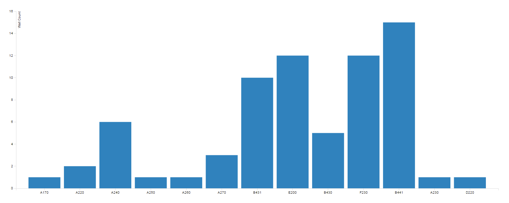
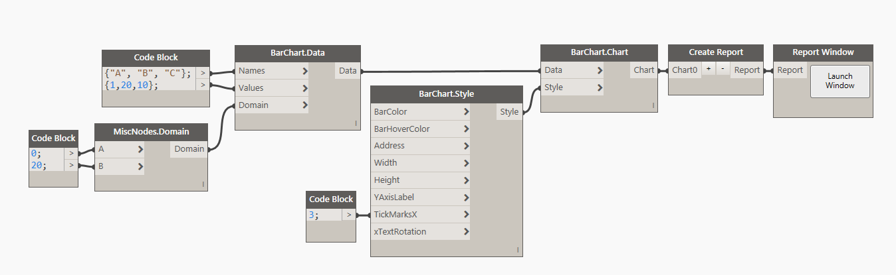

#Bar Chart

##Data:

There are two ways of defining data for a Bar Chart. First is to use a <b>CSV</b> file that was formatted in the following way: 

* First Column is always <b>Name</b> of the data point.
* Second Column is always the numerical <b>Value</b> for the data point.

###Example: 

Another possible way is to define the data in Dynamo directly and then use the node <b>BarChart.Data</b> to define all of the desired data points. Here's a potential sample of defining data in Dynamo:

<blockquote>
Tip: As you can see in the image above, ALWAYS define number of Tick Marks in Chart Style to be <b>equal</b> or <b>less</b> than a number of data points. Specifying more ticks marks will result in an error. Default value is 13. 
</blockquote>

##Style:

Bar Chart Style has a few simple things that can optionally be defined to control the visual appearance of the chart. First two inputs are for controling a color. You can either use a Dynamo Color node or a little bit of DesignScript syntax and a Code Block to define that input. Example: `DSCore.Color.ByARGB(1,220,180,20)`. Width and Height are integer inputs that by default are set to 1000px x 500px. The actual size of the chart is always a little smaller because of margins required for handling axis graphics etc. Tick Marks are an integer input. These define a number of data point names that are being displayed below X Axis. If you have a small data sample or really short names then it makes sense to render them all, but if you have a large data sample, to avoid overlapping text just enter a value that displays less names. Example of a Bar Chart rendered above and its style: 

##Other:

###Row Container

You can have multiple charts in a single row. Please use the "+" and "-" buttons to create more inputs. 

###Create Report

You can have more than one row in a Window. You can feed all of your Row Containers into this node to combine them into a "Report" or "Dashboard" style Window. 
