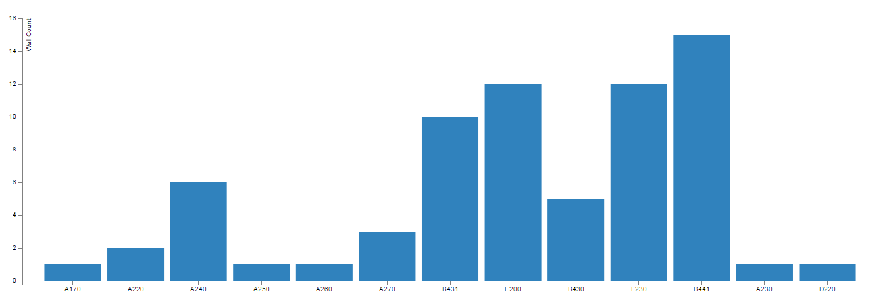
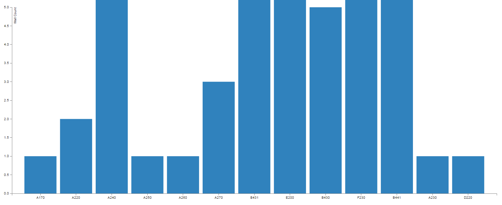

# Domain

Domain is not required for all charts. It can however, be very useful for some of the charts, and especially useful when multiple charts are displayed side by side. Let's take for example three consecutive bar charts, that all measure number of wall types per floor. If they are not "clamped" to a fixed range, then it would be hard to make sense of data. For most of the charts there will be only single Domain and it will usually define the extents of Y Axis. For most charts Domain will start at 0 and end at some meaningful for us number. 

Let me give you an example of the same data set, and two different domains. First has correctly set Domain that starts at 0 and ends at a number that is larger than the highest value in the data set. It looks like this:

Next one, is the same data set, but this time the Domain was incorrectly set to 0-5 which will result in data being rendered a little off:

As, you can see, Domain can be quite important to get the data visualized quite right. By default most of the charts are always set to [0-Max(data)] which should render just fine.