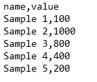
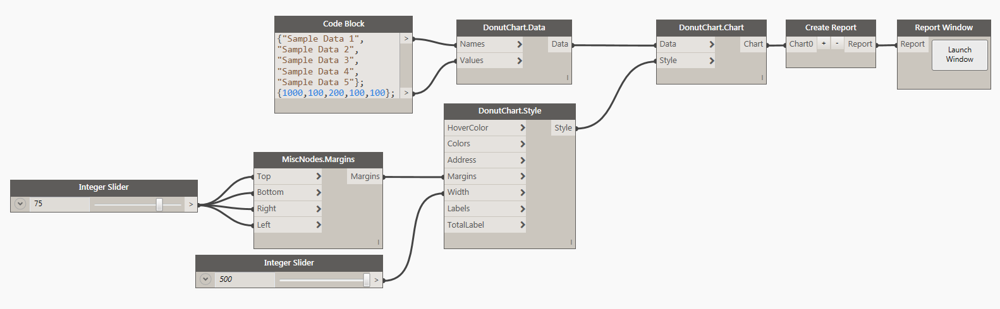
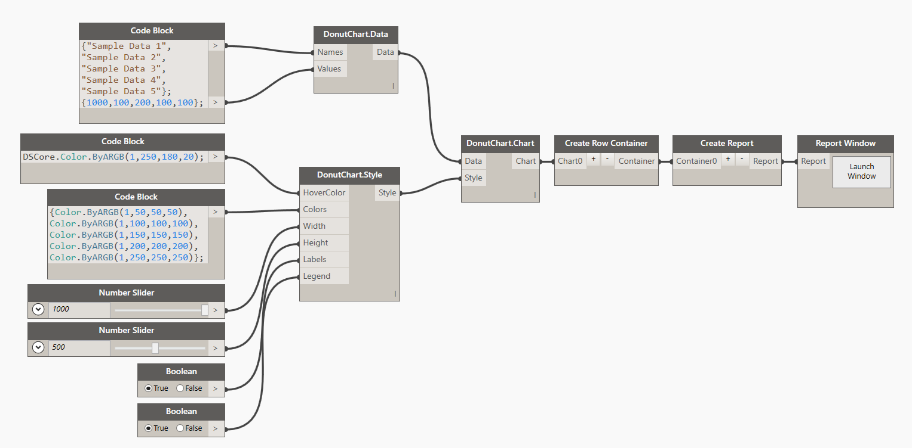
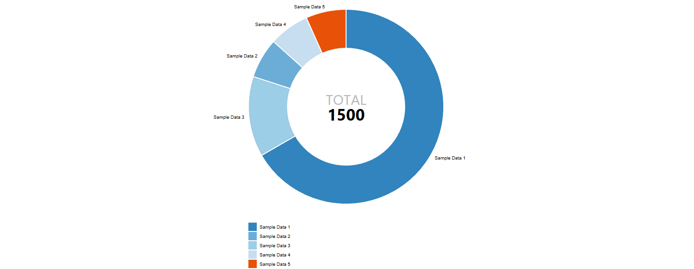

#Donut Chart

##Data:

There are two ways of defining data for a Donut Chart. First is to use a <b>CSV</b> file that was formatted in the following way: 

* First Column is always <b>Name</b> of the data point.
* Second Column is always the numerical <b>Value</b> for the data point.

###Example: 

Another possible way is to define the data in Dynamo directly and then use the node <b>DonutChart.Data</b> to define all of the desired data points. Here's a potential sample of defining data in Dynamo:

##Style:

Donut Chart Style has a few things that can be set optionally to control the visual appearance of the chart. First two inputs are for controling a color. You can either use a Dynamo Color node or a little bit of DesignScript syntax and a Code Block to define that input. Example: `DSCore.Color.ByARGB(1,220,180,20)`. <b>Width</b> and <b>Height</b> are integer inputs that by default are set to 1000px x 500px. The actual size of the chart is always a little smaller because of margins required for handling axis graphics etc. There are also two boolean inputs for <b>Labels</b> and <b>Legend</b>. You probably don't want to show, both, as they basically display the same information. Legend will appear next or below the chart while Labels will be surrounding the chart itself.  

##Other:

###Legends:

<blockquote>
Tip: Width and Height in Donut chart are used a little different than in other charts. Only the smaller of two values is used to determine the Radius of the chart. It's a good idea to use the Height as the smaller value to control the radius, while always make the Width bigger to accomodate for size of labels. If there isn't enough width in the chart, labels might get cropped off. 
</blockquote>

