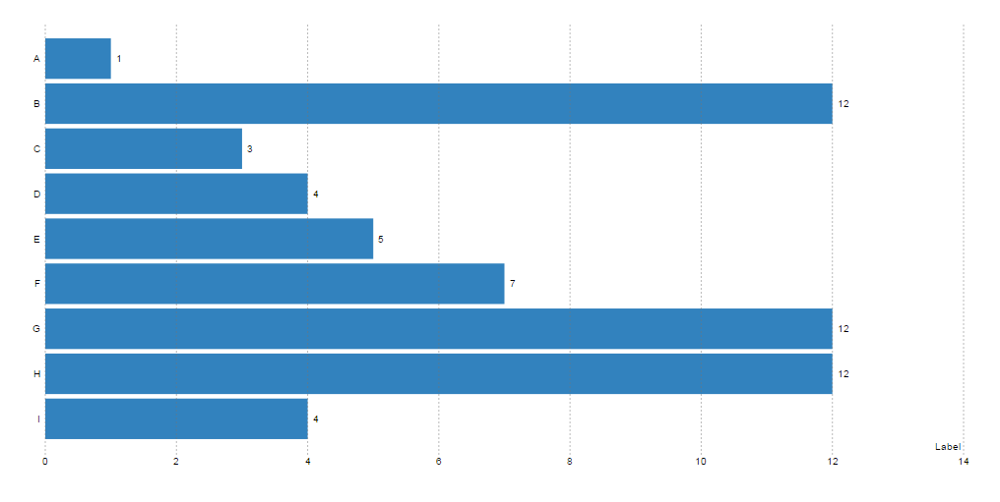
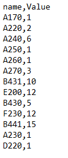
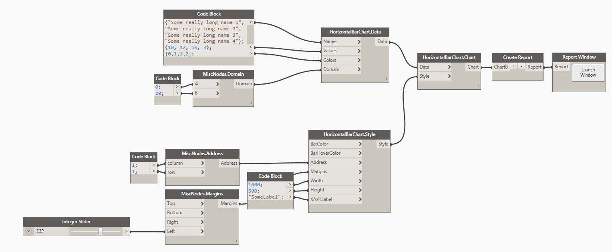
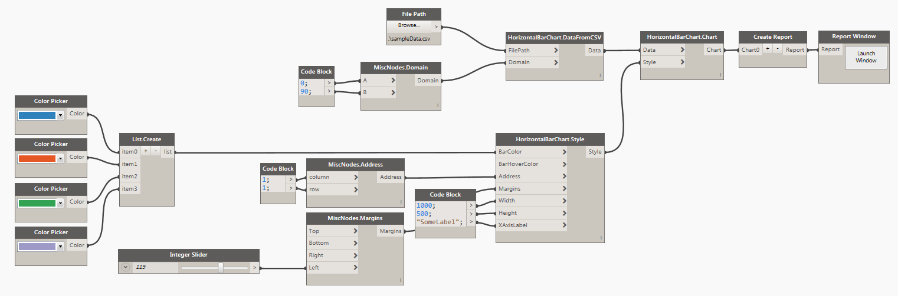

# Horizontal Bar Chart

##Data:

There are two ways of defining data for a Horizontal Bar Chart. First is to use a <b>CSV</b> file that was formatted in the following way: 

* First Column is always <b>Name</b> of the data point.
* Second Column is always the numerical <b>Value</b> for the data point.

###Example: 

Another possible way is to define the data in Dynamo directly and then use the node <b>HorizontalBarChart.Data</b> to define all of the desired data points. Here's a potential sample of defining data in Dynamo:

<blockquote>
As you can see in the image above, if the names of a data samples are really long, please make sure to increase Left margin to prevent any cropping.
</blockquote>

##Style:

Horizontal Bar Chart Style has a few simple things that can optionally be defined to control the visual appearance of the chart. They are very similar to what we have already seen in Bar Chart. First two inputs are for controling a color. You can either use a Dynamo Color node or a little bit of DesignScript syntax and a Code Block to define that input. Example: `DSCore.Color.ByARGB(1,220,180,20)`. <b>Width</b> and <b>Height</b> are integer inputs that by default are set to 1000px x 500px. The actual size of the chart is always a little smaller because of margins required for handling axis graphics etc. Address input can be used to place the chart in a specific location on a page. Grid address represents charts top/left corner. Please see this [page](address.md) for more info on Address. Margins come handy when you need to increase space around the chart to accommodate labels. Please see [this](margins.md) for more info. Example of a Horizontal Bar Chart rendered above and its style: 

<blockquote>
Tip: Chart Address gets reset every time you refresh the page. Page refresh happens on every data or style change. Use Address input to "lock" charts to their position on page, otherwise you will have to move them around a lot.
</blockquote>