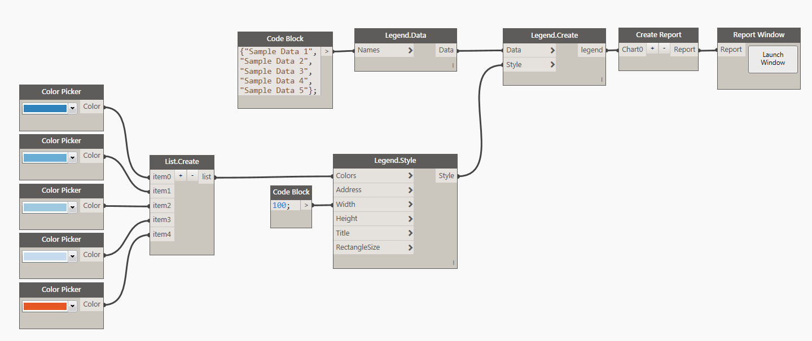
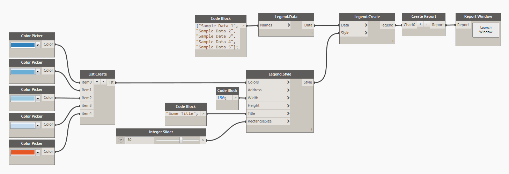

# Legend

Legend is now a stand alone object that can be produced from a list of Colors and Names. It is very similar to how a chart object would be created. 

##Data:

Data for a legend is just a list of strings/names. List should match a list of colors defined in a Style object.

##Style:

Legend Style has a few simple things that can optionally be defined to control the visual appearance of the legend object. First input is for controling a color of each square. You can either use a Dynamo Color node or a little bit of DesignScript syntax and a Code Block to define that input. Example: `DSCore.Color.ByARGB(1,220,180,20)`. <b>Width</b> and <b>Height</b> are integer inputs that by default are set to 200px x 400px. Address input can be used to place the legend in a specific location on a page. Grid address represents legend's top/left corner. Please see this [page](address.md) for more info on Address. Title is a text that appears below the legend. Rectangle size is defined in pixels and also controls the size of text next to those rectangles. Making the rectangle larger will make the fond larger as well, and when that happens make sure that you also increase the width of the legend.

