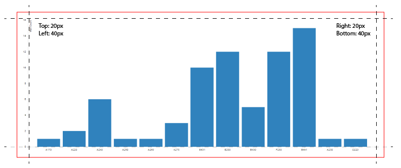
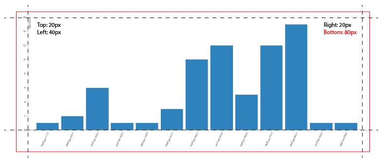

# Margins

Margins are the white space around the actual chart. Some charts require more white space, and some barely need any. All margins are defined in pixels. 

> Default values for margins are:
> * Top: 20px
> * Bottom: 40px
> * Right: 20px
> * Left: 40px

As you can see some of the default values are larger and some are smaller. That's because most of the charts will have their Axis drawn on the bottom and left. To be able to render Axis around the chart, and add names of the values we need more white space, hence larger margins. 

In some situations, for example when you decide to rotate the labels for each bar, you might want to increase the space of the bottom margin to prevent labels being cropped off. 

> Some charts like Donut and Pie Charts, given they are circular, might be best served to have all margins set to the same value. Try it, and see what works best for you.

