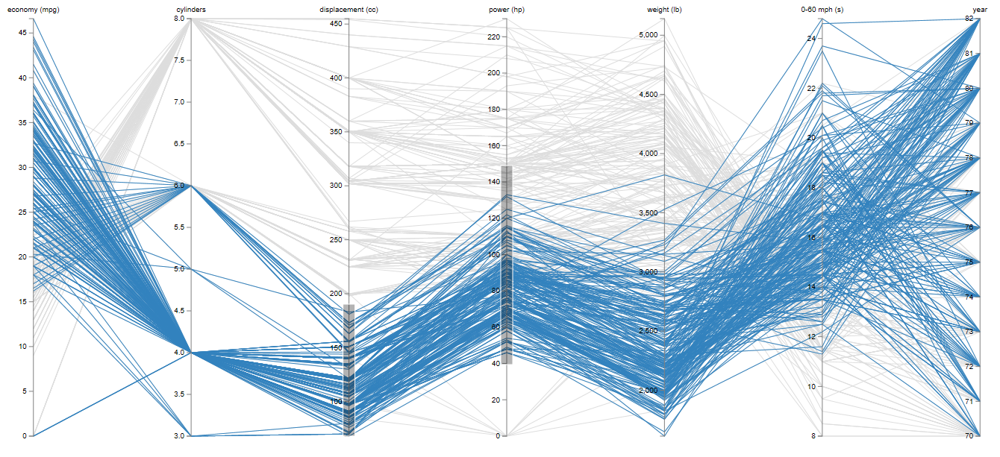
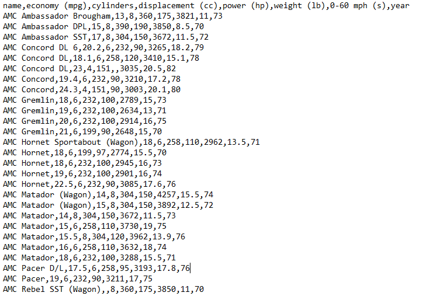
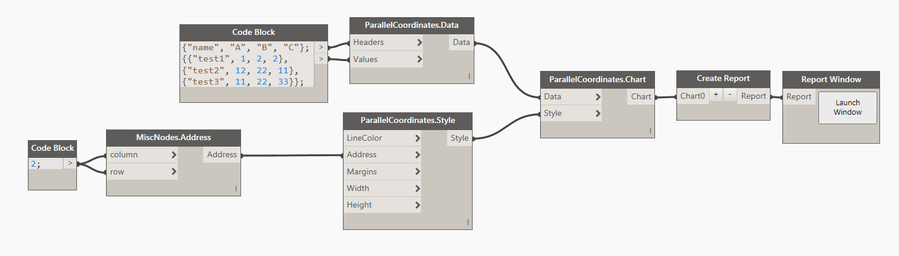

#Parallel Coordinates

##Data:

There are two ways of defining data for Parallel Coordinates Chart. You can use a CSV file formatted in the following manner: 

* First row is always <b>Headers</b>. Headers contain names of individual axis in each group or if you wish for each parameter. In our example its the different properties of the car.
* All of the consecutive rows are considered data points. These are all of the <b>Groups</b> with each row starting with a Group Name and then values for each data point. 

###Example of CSV data:

Another way to define data is to generate it from a list directly in Dynamo. You can do it like so: 

##Style:

There are couple of things that you can define for the appearance of the Parallel Coordinates Chart. First is a <b>Line Color</b>. You can use a Dynamo Color node to define that input or you can use the Design Script syntax like so: `DSCore.Color.ByARGB(1,100,100,100)`. Remaining inputs are integers for <b>Width</b> and <b>Height</b> (default values are 1000px x 500px). 

###Example of style definition:

##Other:

<blockquote>
Tip:If you are not specifying a custom range of colors to be used for this chart, please make sure to feed in a <b>null</b> value to the Colors input. It will cause an exception otherwise. 
</blockquote>

<blockquote>
Grouped Bar Chart is not sorted. It is by default in order of your data input. 
</blockquote>
