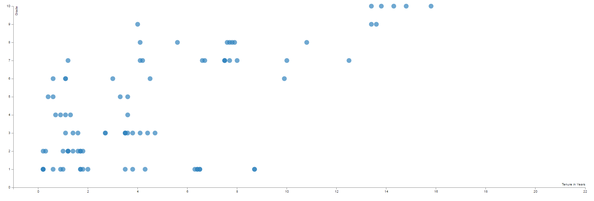
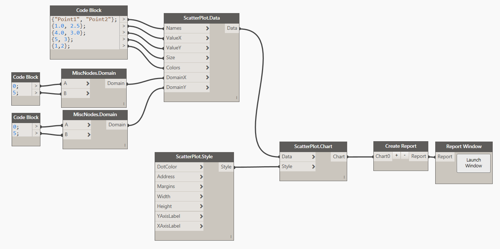
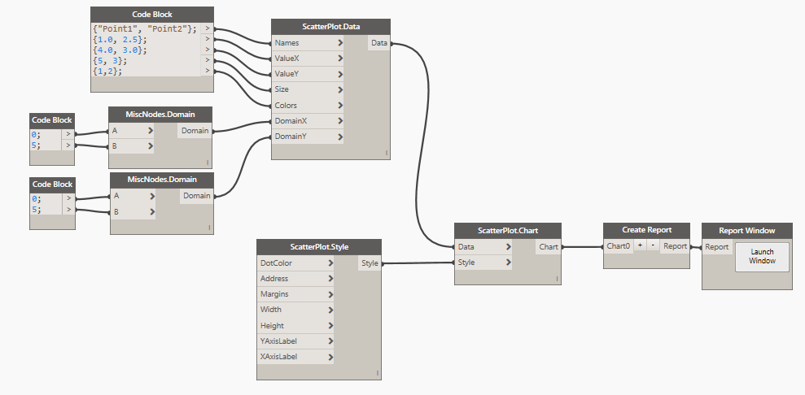
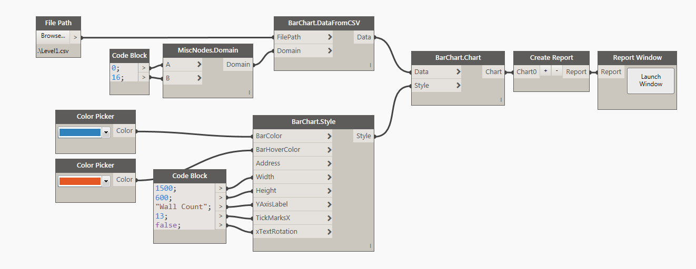
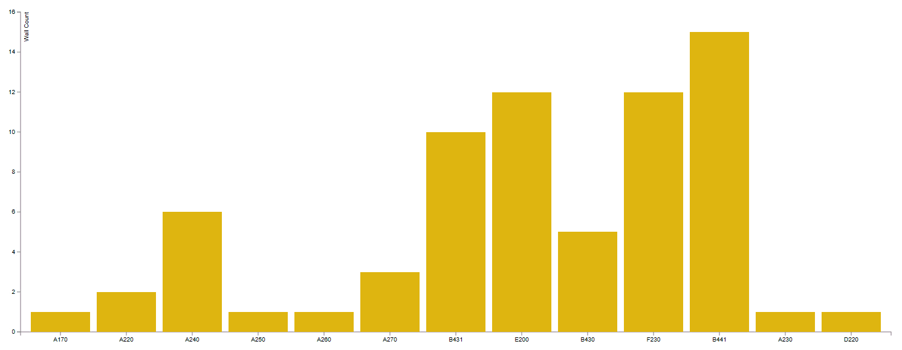

#Scatter Plot

##Data:

There are two ways of defining data for a Scatter Plot Chart. First is to use a <b>CSV</b> file that was formatted in the following way: 

* First Column is always <b>Name</b> of the data point.
* Second Column is always the numerical <b>Value</b> for the data point.

###Example: 

Another possible way is to define the data in Dynamo directly and then use the node <b>ScatterPlot.Data</b> to define all of the desired data points. Here's a potential sample of defining data in Dynamo:

<blockquote>
Tip: As you can see in the image above, ALWAYS define number of Tick Marks in Chart Style to be <b>equal</b> or <b>less</b> than a number of data points. Specifying more ticks marks will result in an error. Default value is 10. 
</blockquote>

##Style:

Bar Chart Style has a few simple things that can optionally be defined to control the visual appearance of the chart. First two inputs are for controling a color. You can either use a Dynamo Color node or a little bit of DesignScript syntax and a Code Block to define that input. Example: `DSCore.Color.ByARGB(1,220,180,20)`. <b>Width</b> and <b>Height</b> are integer inputs that by default are set to 1000px x 500px. The actual size of the chart is always a little smaller because of margins required for handling axis graphics etc. <b>TickMarksX</b> are an integer input. These define a number of data point names that are being displayed below X Axis. If you have a small data sample or really short names then it makes sense to render them all, but if you have a large data sample, to avoid overlapping text just enter a value that displays less names. TextRotation input is a boolean by default set to False. It means that all text labels below xAxis will be horizontal. If this is set to True, text will be rotated at -65 degrees. Address input can be used to place the chart in a specific location on a page. Grid address represents charts top/left corner. Please see this [page](address.md) for more info on Address. Margins come handy when you need to increase space around the chart to accomodate labels. Please see [this](margins.md) for more info. Example of a Bar Chart rendered above and its style: 

<blockquote>
Tip: Chart Address gets reset every time you refresh the page. Page refresh happens on every data or style change. Use Address input to "lock" charts to their position on page, otherwise you will have to move them around a lot.
</blockquote>

##Other:

###Create Report

You can have more than one chart in a Window. You can feed all of your Charts into this node to combine them into a "Report" or "Dashboard" style Window. 

###Sorting:

Clicking on a bar in Bar Chart will result in Bar Chart data sorting event. On a first click, your data will sort itself alphabetically by X Axis names. Clicking on it again, will result in sorting by Y Axis values in descending order from Left to Right. 

