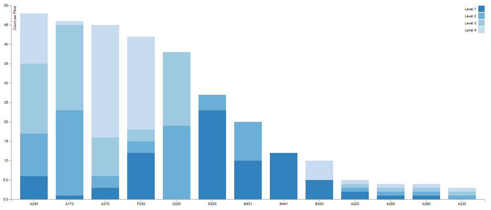
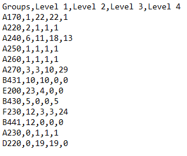
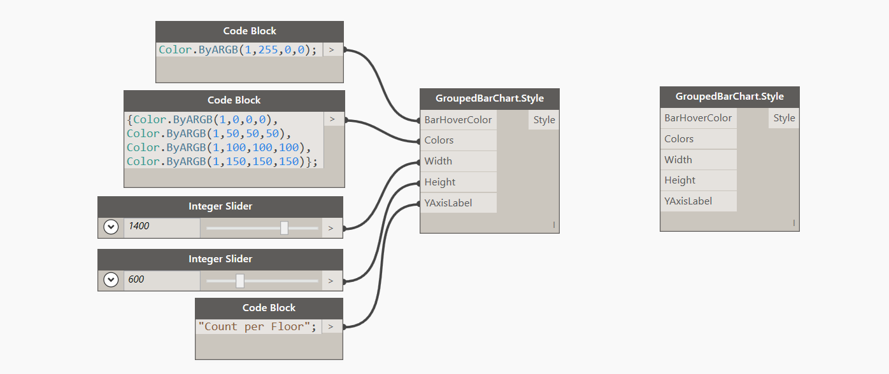

#Stacked Bar Chart

##Data:

There are two ways of defining data for Stacked Bar Chart. You can use a CSV file formatted in the following manner: 

* First row is always <b>Headers</b>. Headers contain names of individual bars (getting stacked) in each stacked bar. So in our example its Level 1, Level 2...etc.
* All of the consecutive rows are considered data points. These are all of the <b>Stacked Groups</b> with each row starting with a Group Name and then values for each data point (in our case Level). 

###Example of CSV data:

Another way to define data is to generate it from a list directly in Dynamo. You can do it like so: 

<blockquote>
Tip: Domain for a Stacked bar chart is defined as a <b>sum</b> of all values within the group. Basically, to get a correctly rendered chart please make sure that your upped Domain value (B) is larger than the maximum of all values within each group. As you can see above the max sum of values for data point A400 is 30 so I am setting my domain a little higher at 35. 
</blockquote>

##Style:

There are couple of things that you can define for the appearance of the Stacked Bar Chart. First is a <b>BarHoverColor</b>. That's a color that a bar will change to when you hover your mouse over. You can use a Dynamo Color node to define that input or you can use the Design Script syntax like so: `DSCore.Color.ByARGB(1,100,100,100)`. Second input is a list of colors. Each bar inside of the Stack can have a specific color of your choosing, or if you supply a `null` value the default color scheme will be applied ([D3 Categorical Colors] (http://bl.ocks.org/aaizemberg/78bd3dade9593896a59d)). <b>Category20c</b> is the default color scheme. Remaining inputs are integers for <b>Width</b> and <b>Height</b> (default values are 1000px x 500px) and a string for <b>YAxisLabel</b>. 

###Example of style definition:

##Other:

<blockquote>
Tip:If you are not specifying a custom range of colors to be used for this chart, please make sure to feed in a <b>null</b> value to the Colors input. It will cause an exception otherwise. 
</blockquote>

Grouped Bar Chart is not sorted. It is by default in order of your data input. 
